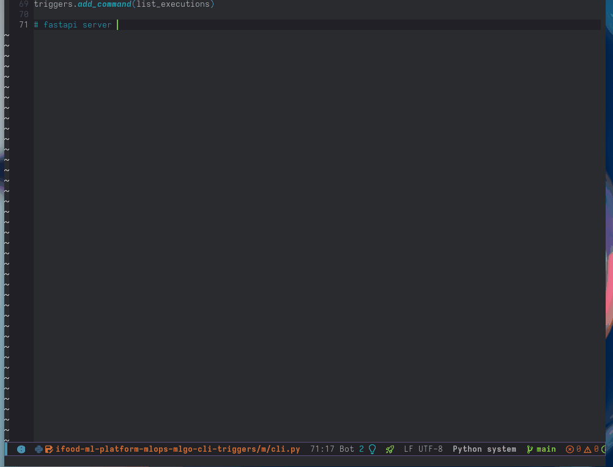

# lsp-mode extension to support Inline Completions

LSP support inline completions for long text that would look weird in the standard textDocument/completion response. This is used by Code Assistant language servers ([Gitlab LSP](https://gitlab.com/gitlab-org/editor-extensions/gitlab-lsp) and apparently [CoPilot node server](https://www.npmjs.com/package/copilot-node-server))



## Installing

### Via Use-Package

<details>

``` elisp
(use-package lsp-inline-completions
  :quelpa (lsp-inline-completions :fetcher github
                                  :repo "kassick/lsp-inline-completions"
                                  :branch "main"
                                  :files ("*.el"))
  :config

  (require 'lsp-inline-completions)
  (add-hook 'lsp-before-inline-completion-hook
            (lambda ()
              ;; scroll to top so preview can show the snippet
              (recenter-top-bottom 4)

              (require 'spinner)
              (spinner-start 'triangle 10)
              ;; Show something, since we can not spin ...
              (message "Asking for suggestions ...")))

  (add-hook 'lsp-after-inline-completion-hook #'spinner-stop)
  (define-key global-map
              (kbd "C-*") '("Inline Completions" . lsp-inline-completion)))
```

</details>

### Spacemacs

<details>

``` elisp
; In dotspacemacs/layers:

(setq-default
 ;; ...
 dotspacemacs-additional-packages
 '(
   ;; ...
   (lsp-inline-completions :location
                           (recipe :fetcher github
                                   :repo "kassick/lsp-inline-completions"
                                   :files ("*.el")))
   ;; ...
   )
 ;; ...
 )


;; In dotspacemacs/user-config:

(require 'lsp-inline-completions)
(add-hook 'lsp-before-inline-completion-hook
          (lambda ()
            ;; scroll to top so preview can show the snippet
            (recenter-top-bottom 4)

            (require 'spinner)
            (spinner-start 'triangle 10)
            ;; Show something, since we can not spin ...
            (message "Asking for suggestions ...")))

(add-hook 'lsp-after-inline-completion-hook #'spinner-stop)
(define-key global-map
            (kbd "C-*") '("Inline Completions" . lsp-inline-completion))
```

</details>


## Details

This should provide completions as long as you have some server available with
the `inlineCompletionProvider` capability.

This code has been heavily inspired by [Copilot.el](https://github.com/copilot-emacs/copilot.el/)
